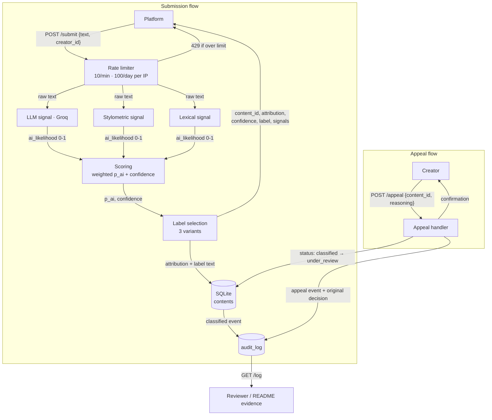

# Provenance Guard — Planning & Spec

A backend a creative-sharing platform plugs into to classify submitted text as
human- or AI-written, score confidence honestly, show readers a transparency
label, and let creators appeal a classification.

This document is written **before** implementation. It is also the prompting
tool used to generate code in Milestones 3–5 (see the [AI Tool Plan](#ai-tool-plan)).

---

## Architecture narrative — the path one piece of text takes

1. A platform sends `POST /submit` with `{text, creator_id}`.
2. The request passes the **rate limiter** (10/min, 100/day per IP). If over
   limit it never reaches detection — it returns `429`.
3. The text is fanned out to **three independent detection signals**, each
   returning an *AI-likelihood* in `[0,1]`:
   - **LLM signal** (Groq `llama-3.3-70b-versatile`) — holistic/semantic read.
   - **Stylometric signal** — sentence-length variance + vocabulary diversity.
   - **Lexical signal** — AI "tell" phrases, opener diversity, punctuation uniformity.
4. **Scoring** combines the three into a single `p_ai`, then derives a
   **confidence** that accounts for how decisive *and* how much in agreement the
   signals are.
5. **Label selection** maps `(p_ai, confidence)` to one of three attribution
   tiers (`likely_ai` / `likely_human` / `uncertain`) and the exact reader-facing
   label text.
6. The content row (with all scores + status `classified`) is written to the
   **`contents`** table; a structured event is appended to the **`audit_log`**.
7. The response returns `content_id`, `attribution`, `confidence`, `label`, and
   the per-signal scores.

**Appeal flow:** A creator sends `POST /appeal` with `{content_id, creator_reasoning}`.
The content's status flips `classified → under_review`, an `appeal` event (carrying
the creator's reasoning *and* the original decision) is appended to the audit log,
and a confirmation is returned. No automated re-classification — a human reviews.

---

## Architecture



**Submission flow:** `POST /submit` → three signals scored in parallel →
weighted into `p_ai` and a confidence that reflects signal agreement → mapped to
one of three labels → persisted and audited → returned to the caller.
**Appeal flow:** `POST /appeal` flips the content to `under_review`, logs the
creator's reasoning beside the original decision, and confirms receipt.

---

## 1. Detection signals

All three return the **same contract**: `{ai_likelihood: float in [0,1], detail: {...}}`,
where `1.0` = "looks fully AI". A uniform contract lets scoring treat them
interchangeably and makes adding/removing a signal cheap.

### Signal 1 — LLM (Groq `llama-3.3-70b-versatile`)
- **Measures:** Holistic, semantic plausibility — does the text *read* as AI
  (generic phrasing, even tone, hedged "balance" structure) or as a specific
  human voice?
- **Why it differs:** A 70B model has seen vast human and AI text; it captures
  coherence and "voice" no single statistic can.
- **Output:** Prompted to return strict JSON `{ai_likelihood, reasoning}`. We
  parse the float; on any API/parse failure the signal returns `None` and is
  **dropped** from scoring (the system degrades to 2 signals rather than crash).
- **Blind spot:** Non-deterministic run-to-run; known bias against formal or
  **non-native-English** human writing; easily fooled by lightly-edited AI.

### Signal 2 — Stylometric burstiness
- **Measures:** (a) **sentence-length variance** (coefficient of variation of
  sentence word-counts) and (b) **type-token ratio** (unique words ÷ total =
  vocabulary diversity).
- **Why it differs:** Human writing is *bursty* — long sentences next to short
  ones — and varied in word choice. AI text trends uniform and mid-diversity.
  Low variance + mid TTR → higher AI-likelihood.
- **Output:** Each metric normalized to a 0–1 AI-likelihood, then averaged.
- **Blind spot:** Needs enough text (≈40+ words) to be meaningful; flags terse,
  repetitive, or list-like **human** writing (poetry) as AI.

### Signal 3 — Lexical fingerprint *(stretch: ensemble 3rd signal)*
- **Measures:** Density of AI "tell" phrases ("it is important to note",
  "furthermore", "in conclusion", "delve", "tapestry"…), **sentence-opener
  diversity** (do sentences start the same way?), and punctuation uniformity.
- **Why it differs:** Instruction-tuned models over-use connective boilerplate
  and formulaic openers far more than individual humans.
- **Output:** Weighted blend of the three sub-metrics → 0–1.
- **Blind spot:** A human deliberately writing formal/academic prose trips it;
  trivially evaded by paraphrase.

**Why these three:** they are genuinely independent *families* — holistic-semantic
(1), statistical-structural (2), lexical-surface (3). A text can fool one family
and still be caught by another, and their **disagreement is itself signal** (it
drives confidence down → "uncertain").

### Combining them
```
p_ai = 0.5·llm + 0.3·stylometry + 0.2·lexical      # LLM most trusted
```
If the LLM signal is unavailable, its weight is redistributed proportionally
across the remaining two (renormalized) so the score stays in `[0,1]`.

---

## 2. Uncertainty representation

**What I decided 0.5 should mean to a user, first:** "the system genuinely does
not know." Confidence is therefore *not* `p_ai` — it is how much we should trust
whatever direction `p_ai` points.

```
decisiveness = 2·|p_ai − 0.5|                      # 0 at the fence, 1 at the extremes
agreement    = 1 − min(1, stdev(signal_scores)/0.35)   # signals disagree → toward 0
confidence   = decisiveness · (0.5 + 0.5·agreement)    # rounded to 2 dp
```
- A text where all signals scream "AI" and **agree** → high decisiveness × high
  agreement → confidence ≈ 0.8–0.95.
- A text at `p_ai = 0.51`, or where the three signals scatter → confidence near
  0 → forced into **uncertain**.

**Calibrated bands** (`confidence` → word shown to the reader):
`High ≥ 0.66`, `Medium 0.45–0.65`, `Low < 0.45`.

**Thresholds (deliberately asymmetric — a false positive is the worst outcome):**

| Attribution | Condition |
|---|---|
| `likely_ai` | `p_ai ≥ 0.70` **and** `confidence ≥ 0.55` |
| `likely_human` | `p_ai ≤ 0.40` **and** `confidence ≥ 0.55` |
| `uncertain` | everything else |

The AI bar sits `0.20` above center; the human bar only `0.10` below. **It is
harder to be accused of being AI than to be cleared as human** — we will not
label a human's work as AI on weak evidence. Anything in the wide `0.40–0.70`
middle, or any low-confidence / disagreeing case, lands in `uncertain`.

> **Implementation note (post-calibration).** Running the calibration set
> revealed this exact pairing makes `likely_ai` *unreachable*: with
> `confidence = decisiveness·(0.5+0.5·agreement)`, a `p_ai` of 0.70 caps
> confidence at 0.40 — below the 0.55 gate. The shipped system therefore uses
> rebalanced weights (`LLM 0.6 / 0.2 / 0.2`), thresholds `AI 0.62 / HUMAN 0.45 /
> MIN_CONFIDENCE 0.45`, and `confidence = agreement·(0.5+0.5·margin)`. The
> *spirit* above (asymmetry + disagreement→uncertain) is preserved; `config.py`
> is the source of truth for the numbers. See README → Spec reflection.

---

## 3. Transparency label design — the three exact variants

`{XX%}` is the computed confidence; `{High/Medium/Low}` is its band.

| Tier | Exact label text |
|---|---|
| **High-confidence AI** (`likely_ai`) | ⚠ **Likely AI-generated.** This content shows strong signs of AI generation. Several independent checks agreed its style and structure closely match AI-written text. **Confidence: {High} ({87}%).** No detector is perfect — if you wrote this yourself, you can appeal this label. |
| **High-confidence human** (`likely_human`) | ✓ **Likely human-written.** This content reads as human-written. Our checks found the natural variation and individual style typical of a human author, with no strong signs of AI generation. **Confidence: {High} ({84}%).** |
| **Uncertain** (`uncertain`) | ❓ **Authorship uncertain.** We can't confidently say who wrote this. Our checks either disagreed or found only weak signals. **Confidence: {Low} ({38}%).** We've labeled it 'uncertain' rather than guess — please treat the result with caution. |

Design choices: plain language, no jargon (no "p_ai", "stylometry"); confidence
shown as both a word and a number; the AI label *explicitly invites appeal*
(honoring the false-positive asymmetry); "uncertain" openly admits the system
doesn't know rather than guessing.

---

## 4. Appeals workflow

- **Who:** any creator who believes their content was misclassified. (In a real
  deployment this would be authenticated to the `creator_id` on the content; here
  it is open for grading visibility.)
- **They provide:** `content_id` (from the `/submit` response) and
  `creator_reasoning` (free text — why they believe it's wrong).
- **System does:**
  1. Verifies the `content_id` exists (404 if not).
  2. Updates that content's status `classified → under_review`.
  3. Appends an `appeal` event to the audit log carrying the creator's reasoning
     **and** a snapshot of the original decision (attribution, confidence, all
     signal scores) so a reviewer sees both side by side.
  4. Returns a confirmation `{content_id, status: "under_review", message}`.
- **No automated re-classification** — a human decides.
- **What a reviewer sees in the queue:** every row where `status = under_review`,
  joined to its original `classified` audit event and the new `appeal` event:
  original text, original attribution + confidence + the three signal scores,
  and the creator's stated reasoning.

---

## 5. Anticipated edge cases (handled, not hand-waved)

1. **Short / minimalist poetry** (haiku, heavy repetition, tiny vocabulary):
   sentence-variance is undefined and TTR is distorted on very short text, so
   stylometry + lexical wrongly read "AI". *Handling:* short texts naturally
   produce scattered signals → low agreement → low confidence → **uncertain**,
   not a false AI accusation.
2. **Formal or non-native-English human writing** (academic abstract, ESL
   author): low burstiness + formal connectives push *all three* signals (incl.
   the LLM's bias) toward AI — the classic **false positive**. *Handling:* the
   asymmetric `0.70` AI bar plus the always-available appeal path are the safety
   net; this is the scenario the whole asymmetry design exists for.
3. **Lightly-edited AI** (AI draft a human tweaked): the LLM may still smell AI
   while stylometry now looks human → high disagreement → confidence collapses →
   **uncertain**. A faithful outcome: the system says "I'm not sure," which is
   the truth.

---

## AI Tool Plan

I author code with an AI assistant, feeding it the relevant spec sections + the
architecture diagram, then verify every output against this document before use.

- **M3 — submission endpoint + first signal.**
  *Provide:* §1 (signal 1) + the Architecture diagram + §4 API contract.
  *Ask for:* Flask `app.py` skeleton with `POST /submit` stub returning a
  hardcoded response, then the `llm_signal()` function (strict-JSON Groq prompt),
  plus `db.py` + a first `audit.py`.
  *Verify:* call `llm_signal()` directly on 2–3 texts and inspect the JSON before
  wiring it in; `curl /submit` returns `content_id` + a log entry appears.

- **M4 — second/third signals + confidence scoring.**
  *Provide:* §1 (signals 2 & 3) + §2 (uncertainty) + the diagram.
  *Ask for:* `stylometry_signal()`, `lexical_signal()`, and `scoring.py`
  implementing the exact `p_ai`/`confidence`/threshold math from §2.
  *Verify:* the generated thresholds match §2 *to the number* (AI tools drift
  here); run the 4 calibration inputs and confirm clearly-AI vs clearly-human
  scores diverge and signals can disagree.

- **M5 — production layer.**
  *Provide:* §3 (label variants) + §4 (appeals) + the diagram + rate-limit note.
  *Ask for:* `labels.py` mapping `(p_ai, confidence)` → the three exact strings,
  the `POST /appeal` endpoint, and Flask-Limiter config.
  *Verify:* all three label variants are reachable from real inputs and match §3
  verbatim; an appeal flips status to `under_review` and logs reasoning beside
  the original decision; 12 rapid submits show `200×10` then `429`.

---

## Stretch features (planned after the required 7 passed)

All four required-feature checkpoints were green before starting these. Each one
was added without breaking the core contract; the README documents the shipped
behavior and evidence.

### S1 — Ensemble detection *(done as part of the core build)*
Three signals instead of the required two, combined by a documented weighted
average (`p_ai = 0.6·LLM + 0.2·stylometry + 0.2·lexical`), auto-renormalizing if
the LLM signal is unavailable. The two heuristics also feed the `agreement` term,
so the third signal materially changes outcomes (it was lexical disagreement that
correctly rescued the formal-human case from a false positive).

### S2 — Multi-modal support (image metadata)
A second `content_type` (`image_metadata`) routes to its own two-signal pipeline:
1. **generator-signature** — explicit AI-tool markers (software/generator/prompt
   fields, C2PA `ai_generated` assertion). Near-conclusive when present.
2. **camera-plausibility** — presence of real-capture EXIF (make/model, ISO,
   exposure, lens, GPS). Rich EXIF → human; absence → weak AI lean.

To support this without special-casing, `scoring.combine(signals, weights)` was
generalized to take any signal dict + weight table, and the `contents`/audit
schema now stores signal scores as JSON (`signals_json`) plus a `content_type`
column. *Blind spot:* metadata is strippable/forgeable, so bare metadata with no
camera data lands `uncertain` by design. *Weights:* `generator 0.65 / camera 0.35`.

### S3 — Provenance certificate (verified-human credential)
A creator earns a **"✓ Verified Human Creator"** badge via a two-step challenge:
`POST /verify/start` issues a phrase → the creator types it back to
`POST /verify/complete` → an HMAC-signed credential is stored. The badge is then
attached to that creator's `/submit` responses and queryable at
`GET /creator/<id>/credential`.

*Design boundary (important):* the credential is about **creator identity, not a
claim about any single piece of content.** Verified creators' submissions are
still classified normally — the badge never overrides detection. A verified human
whose work is flagged AI is exactly a strong appeal candidate (demonstrated in the
README). This keeps the two concerns (who you are vs. what this text is) honest
and separate. The typed-phrase step is a lightweight presence check, not identity
proofing — a production system would use captcha / OAuth / ID.

### S4 — Analytics dashboard
`GET /analytics` (JSON) and `GET /dashboard` (HTML) aggregate the audit trail into
platform metrics: detection-pattern breakdown by attribution tier **and** content
type, appeal rate, average confidence, and uncertain-rate (a health signal — a
high uncertain rate means the system is honestly declining to guess). Reads
straight from `contents` + `audit_log`; no new write path.
